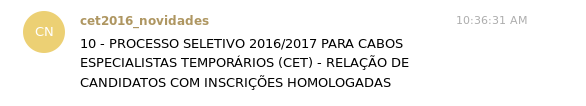

# bot_atualizacoes_eb_cet_2016
Bot desenvolvido por mim, responsável pelo acompanhamento das atualizacoes no site do processo seletivo CET 2016 - Cabo Especialista Temporario 2016 do exercito Brasileiro e me notificar pelo telegram.

</img>

# Instale as dependencias
pip install -r requeriments.txt

# Configuracoes:

No caso de utilização por terceiros, é necessário configurar os campos "bot_key" para a key criado do seu bot do telegram.
config = {"bot_key":"key_do_seu_bot","grupo_id":id_do_seu_grupo(int),"url":"http://www.11rm.eb.mil.br/index.php/ultimas-noticias/143-cet-cabo-especialista-temporario-2016"}

